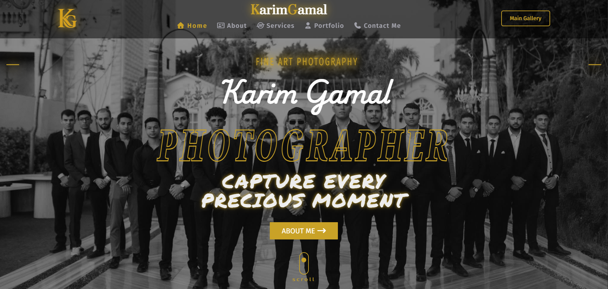
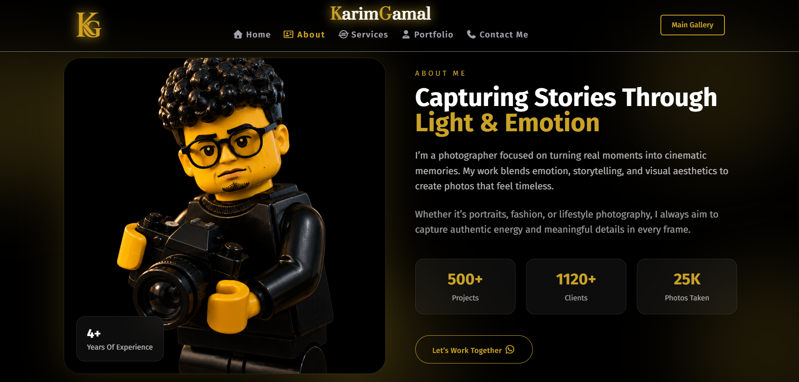
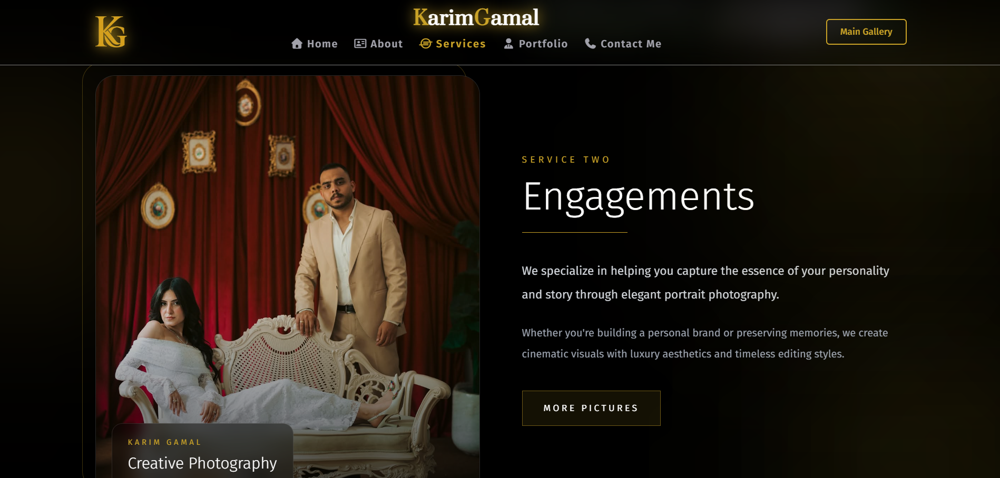
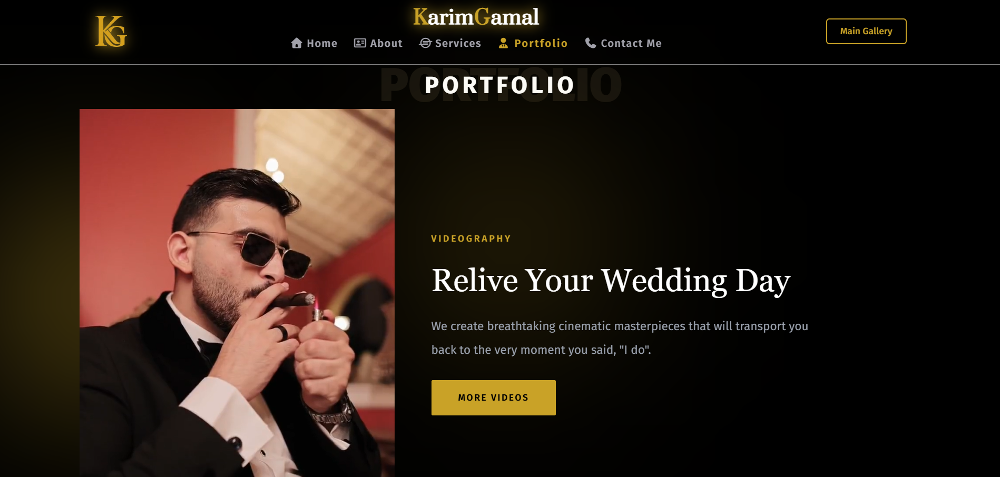
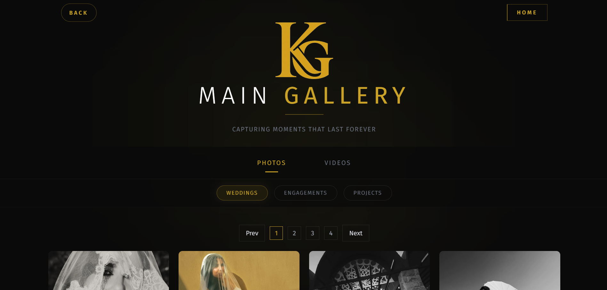

# 📸 Karim Gamal Photography Portfolio

A modern, responsive photography and videography portfolio built with React.js and Tailwind CSS.  
The project showcases high-quality visuals with a clean, cinematic, and smooth user experience.

---

## ✨ Features

- 📷 Responsive image gallery (masonry/grid layout)
- 🖼️ Image modal with next/previous navigation
- ⚡ Lazy loading for images (better performance)
- 🎥 Video gallery with optimized loading
- 🖼️ Video poster thumbnails (no black screen delay)
- ☁️ Cloudinary integration for fast media delivery
- 🔍 Category-based filtering (images & videos)
- 📄 Pagination system for large galleries
- 🎨 Smooth hover effects and modern UI design
- 📱 Fully responsive (mobile / tablet / desktop)

---

## 🛠️ Tech Stack

- React.js
- Tailwind CSS
- JavaScript (ES6+)
- Cloudinary (Media Hosting)
- Font Awesome (Icons)

---

## 📁 Project Structure

src/
├── assets/
├── components/
│ ├── Gallery/
│ │ ├── MediaNav/
│ │ ├── VideoGrid/
│ ├── Home/
│ │ ├── About/
│ │ ├── Contact/
│ │ ├── HeroSection/
│ │ ├── Navbar/
│ │ ├── Portfolio/
│ │ ├── Services/
│ ├── Shared/
│ │ ├── CategoryNav/
│ │ ├── Footer/
│ │ ├── ImageGrid/
├── Context/
├── data/
├── pages/
├── Layout.jsx/
├── Main.jsx/
└── App.jsx

---

## 🚀 Getting Started

### 1. Clone the repository

git clone https://github.com/your-username/karim-gamal-portfolio.git

### 2. Install dependencies

npm install

### 3. Run the project

## npm start

## 🌐 Live Demo

Try the app live : https://your-project-name.vercel.app

---

## ☁️ Cloudinary Setup

This project uses Cloudinary for optimized image and video delivery.

## Images:

## 📸 Screenshots

  
  
  
  
  

---

## 🚀 Future Improvements

- 🔄 Infinite scroll instead of pagination
- 🎞️ Advanced video player controls
- ❤️ Favorites system for images/videos
- 🌙 Dark/Light mode toggle
- 🔍 Advanced search and filtering
- ⚡ Preloading next media for smoother UX

---

## Author

- **Youssef waleed beshir**
- GitHub: https://github.com/Youssef-W-Bashir
- LinkedIn : https://www.linkedin.com/in/youssef-waleed-887072385?utm_source=share_via&utm_content=profile&utm_medium=member_android
- Email: youssef31200w@gmail.com
